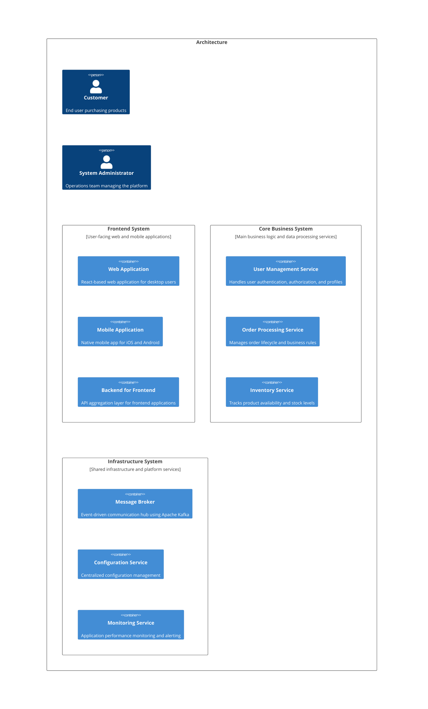

# Documentation as Code Strategies

## Overview

Documentation as Code (Docs as Code) is the practice of treating documentation with the same rigor as software code — version control, automated validation, peer review, and CI/CD pipelines. The FINOS Architecture as Code (AasC) project extends this concept to software architecture, managing architecture through a human and machine-readable, version-controlled codebase.

## Architecture as Code (FINOS CALM)

The CALM (Common Architecture Language Model) framework enables managing architecture documentation alongside code:

### Core Principles
- CALM architectures must be valid JSON that conforms to the CALM JSON Schema specification
- Nodes must have unique-ids that are referenced in relationships
- Relationships connect nodes using relationship-type and must reference valid node unique-ids
- Interfaces define how nodes communicate and must use the oneOf constraint correctly
- Patterns are reusable architecture templates that can be instantiated into concrete architectures
- Use 'calm validate' to check architectures against schemas and patterns
- Use 'calm docify' to generate documentation websites from architecture documents

### CALM CLI Tooling
The CALM CLI is the backbone of the tooling ecosystem, providing essential operations:
- `calm generate` — creating architectures from patterns
- `calm validate` — ensuring compliance with schemas
- `calm docify` — generating documentation sites from architecture definitions
- `calm template` — rendering files (e.g., IaC) from bundles
- `calm diff` — comparing architecture versions (useful for CI pipelines)

### Generate Documentation from Architecture
```shell
calm docify \
  --architecture ./calm/getting-started/conference-signup.arch.json \
  --output ./calm/getting-started/website
```

### Generate Web Viewable Architecture Documentation
```bash
mkdir -p calm-demos/build-calm-architecture/docs/html
calm docify -a trading-system.architecture.json -o docs/html --verbose
cd docs/html && npm install
npm start
```

### Render Infrastructure as Code from Architecture
```bash
# Apply a bundle to your architecture and render IaC
calm template -a architecture.json -b ./bundles/k8s-kustomize
```

### Architecture Overview Template (Handlebars)
```handlebars
# {{name}}

{{description}}

## Architecture Diagram

{{> architecture-diagram}}

## Components

{{#each nodes}}
### {{name}}
{{description}}

**Type:** {{node-type}}
{{#if data-classification}}**Data Classification:** {{data-classification}}{{/if}}

{{#if interfaces}}
#### Interfaces
{{#each interfaces}}
- **{{unique-id}}**: {{#if url}}{{url}}{{else}}{{host}}:{{port}}{{/if}}
{{/each}}
{{/if}}

{{/each}}

## Flows

{{#each flows}}
### {{description}}

{{#each steps}}
{{@index}}. **{{description}}**
   - Nodes: {{#each node-interactions}}{{node}}{{#unless @last}}, {{/unless}}{{/each}}
{{/each}}

{{/each}}
```

## Architecture Documentation Best Practices (from Awesome Software Architecture)

- **Architecture as Code**: Keep architecture diagrams in code (e.g., C4 model, Mermaid) rather than in separate tools — promotes consistency and maintainability
- **Architecture Decision Records (ADRs)**: Document architectural choices and their rationale, serving as a log that answers "WHY?" behind decisions
- **arc42 Template**: Provides a structured approach for software architecture documentation and communication (see doc-sprawl-prevention.md)
- **C4 Model**: Use for visualizing system components, their relationships, and deployment structure

### C4 Deployment Diagram Example (Mermaid)


## Key Takeaways for Docs as Code

1. **Version everything** — docs, diagrams, ADRs all in the same repository as code
2. **Automate generation** — use CLI tools to generate documentation from source (code comments, architecture definitions, patterns)
3. **Validate** — treat documentation as testable artifacts with schema validation
4. **Templatize** — use templates (Handlebars, YAML configs) for consistent documentation structure
5. **CI/CD integration** — use doc generation and validation in CI pipelines, diff tools for change tracking
