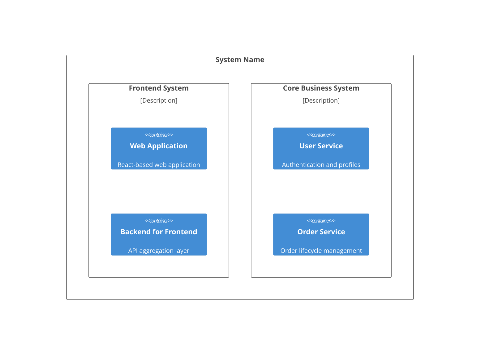

# Documentation Generation Tools

## 1. documentation.js

documentation.js is a powerful documentation system for modern JavaScript, supporting various syntaxes and type annotations. It infers code details from JSDoc comments and generates customizable output in formats like HTML, JSON, and Markdown.

### Use YAML Configuration with CLI

```bash
documentation build src/** -f html -o docs --config documentation.yml
documentation build index.js -f md --config docs-config.yml > API.md
```

### Use Custom Theme Programmatically

```javascript
import documentation from 'documentation';

documentation.build(['src/index.js'], {
  access: ['public'],
  github: true
}).then(comments =>
  documentation.formats.html(comments, {
    theme: './custom-theme',
    projectName: 'My API',
    projectVersion: '1.0.0'
  })
).then(output => {
  output.forEach(file => {
    require('fs').writeFileSync(`docs/${file.path}`, file.contents);
  });
});
```

### YAML Configuration for Documentation Organization

```yaml
# documentation.yml - Full configuration reference
toc:
  - Map
  - name: Geography
    description: |
      These are ways of representing locations
      and areas on the sphere.
    file: docs/geography.md   # Include external markdown
  - LngLat
  - LngLatBounds
  - name: Core Classes
    description: |
      The main classes for working with maps
    children:
      - Map
      - MapOptions
      - Camera
  - name: Navigation
    description: |
      Helper functions for navigation
    children:
      - shortestPath
      - calculateDistance
```

### Key Features
- Supports JSDoc, Closure Compiler, TypeScript type annotations
- Output formats: HTML, JSON, Markdown
- Customizable themes
- YAML configuration for TOC, grouping, and narrative sections
- Can include external markdown files in documentation output

---

## 2. FINOS CALM CLI Documentation Tools

The CALM CLI provides dedicated documentation generation capabilities for architecture documentation.

### Generate Documentation Website from Architecture
```shell
calm docify \
  --architecture ./calm/getting-started/conference-signup.arch.json \
  --output ./calm/getting-started/website
```

### Full Documentation Generation Workflow
```bash
# 1. Create output directory
mkdir -p calm-demos/build-calm-architecture/docs/html

# 2. Generate documentation website
calm docify -a trading-system.architecture.json -o docs/html --verbose

# 3. Verify generated files
ls -la calm-demos/build-calm-architecture/docs/html/

# 4. Start development server (Docusaurus-based)
cd docs/html && npm install
npm start
```

### CALM CLI Tooling Ecosystem
| Command | Purpose |
|---------|---------|
| `calm generate` | Generate architectures from reusable patterns |
| `calm validate` | Validate architectures against schemas and patterns |
| `calm docify` | Generate documentation websites from architecture definitions |
| `calm template` | Render files (e.g., IaC) from architecture + bundle |
| `calm diff` | Compare architecture versions (for CI pipelines) |

---

## 3. C4 Model + Mermaid for Diagram-as-Code

Keep architecture diagrams in code using Mermaid syntax within markdown files. This approach integrates diagrams directly with documentation and version control.

### C4 Deployment Diagram Example


---

## 4. Recommended Toolchain Summary

| Tool | Purpose | Best For |
|------|---------|----------|
| **documentation.js** | API reference generation from code comments | JavaScript/TypeScript projects |
| **CALM CLI** | Architecture documentation from JSON definitions | Complex system architecture docs |
| **Mermaid** | Diagram-as-code (C4, flowcharts, sequence diagrams) | Embedded diagrams in markdown |
| **JSDoc/TSDoc** | Inline code documentation | Developer-facing API docs |
| **Docusaurus** | Documentation website framework | Public-facing documentation sites |
| **Mintlify** | Modern documentation platform | SaaS/API product documentation |
| **Storybook** | Component documentation and playground | UI component libraries |
| **Swagger/OpenAPI** | API specification docs | REST API documentation |

### CI/CD Integration Pattern
```yaml
# In CI pipeline (GitHub Actions example)
- name: Generate Documentation
  run: |
    documentation build src/** -f html -o docs --config documentation.yml
    calm docify -a architecture.json -o docs/architecture --verbose

- name: Validate Documentation
  run: |
    calm validate -a architecture.json
    # Check for broken links
    npx broken-link-checker docs/ --recursive
```
