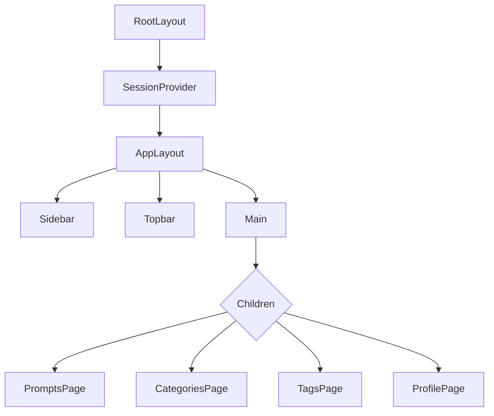
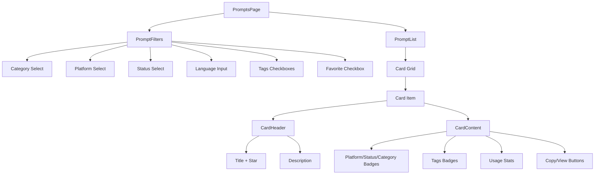
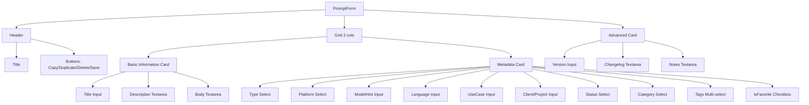
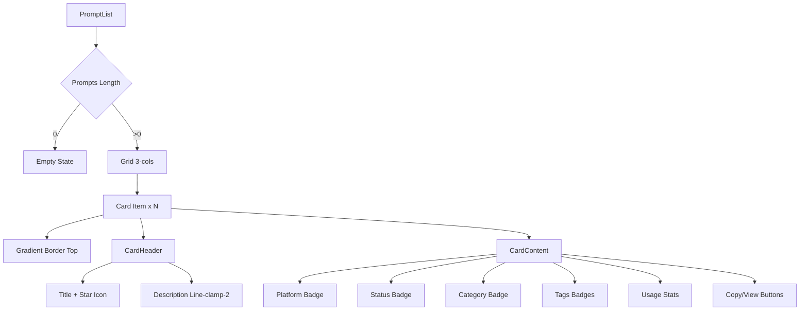

# Informe Técnico: Análisis de UI - Prompt Database

**Fecha:** 2026-04-21  
**Versión:** 1.0  
**Estado:** Análisis inicial completo

---

## Índice de Contenido

1. [Resumen Ejecutivo](#resumen-ejecutivo)
2. [Arquitectura General de la UI](#arquitectura-general-de-la-ui)
3. [Inventario de Componentes](#inventario-de-componentes)
4. [Jerarquía y Composición](#jerarquía-y-composición)
5. [CRUD de Prompts (UI)](#crud-de-prompts-ui)
6. [Formulario, Listado y Componentes Base](#formulario-listado-y-componentes-base)
7. [Sistema de Filtros y Búsqueda](#sistema-de-filtros-y-búsqueda)
8. [Patrones UX Actuales](#patrones-ux-actuales)
9. [Gestión de Estado en Frontend](#gestión-de-estado-en-frontend)
10. [Relación UI ↔ API](#relación-ui--api)
11. [Relación UI ↔ Modelo de Datos](#relación-ui--modelo-de-datos)
12. [Riesgos de Modificar la UI](#riesgos-de-modificar-la-ui)

---

## Resumen Ejecutivo

Prompt Database es una aplicación Next.js (App Router) construida con React Server Components y Client Components, utilizando shadcn/ui (wrapper sobre Radix UI) para los componentes base. El sistema permite gestionar prompts para IA (ChatGPT, Cursor, Midjourney, Suno) con categorización jerárquica, etiquetas (tags), y seguimiento de uso.

**Características principales:**
- Gestión completa de prompts (CRUD)
- Sistema de categorías con árbol jerárquico (padre/hijo)
- Sistema de etiquetas (tags) many-to-many
- Exportación/Importación de datos en JSON
- Contador de uso y última fecha de uso
- Favoritos
- Autenticación con NextAuth (JWT + Credentials)

**Stack tecnológico:**
- Framework: Next.js 14+ (App Router)
- UI Library: shadcn/ui (Radix UI + Tailwind CSS)
- Database: PostgreSQL (Prisma ORM)
- Auth: NextAuth.js con Credentials provider
- Validación: Zod

---

## Arquitectura General de la UI

### Estructura de Rutas

```
/app/
├── layout.tsx                    # Layout raíz (SEO, Provider)
├── (app)/                        # Rutas protegidas (middleware)
│   ├── layout.tsx                # Layout principal (Sidebar + Topbar + Main)
│   ├── page.tsx                  # Redirección a /prompts
│   ├── prompts/
│   │   ├── page.tsx              # Listado de prompts + Filtros
│   │   ├── new/page.tsx          # Crear prompt
│   │   └── [id]/page.tsx         # Editar prompt (reutiliza PromptForm)
│   ├── categories/page.tsx       # Gestión de categorías
│   ├── tags/page.tsx             # Gestión de tags
│   └── auth/profile/page.tsx     # Perfil de usuario
├── (auth)/                       # Rutas públicas (sin auth)
│   ├── layout.tsx
│   ├── auth/signin/page.tsx      # Login
│   └── auth/signup/page.tsx      # Registro
└── api/                          # Endpoints API (ver sección 10)
```

### Layout Principal

**`/app/(app)/layout.tsx`** define la estructura base:

```
┌─────────────────────────────────────────────────────────────┐
│                      Sidebar (w-64)                         │
│  - Logo Prompt DB                                           │
│  - Navegación: Prompts, Categories, Tags                  │
│  - Perfil de usuario                                        │
├─────────────────────────────────────────────────────────────┤
│  ┌───────────────────────────────────────────────────────┐  │
│  │                    Topbar (h-16)                      │  │
│  │  - Search (búsqueda global)                           │  │
│  │  - New Prompt (botón principal)                       │  │
│  │  - Export / Import (JSON)                             │  │
│  │  - Profile / Sign Out                                 │  │
│  └───────────────────────────────────────────────────────┘  │
│  ┌───────────────────────────────────────────────────────┐  │
│  │                     Main Content                      │  │
│  │  (p-6, overflow-y-auto, children)                     │  │
│  └───────────────────────────────────────────────────────┘  │
└─────────────────────────────────────────────────────────────┘
```

### Flujos de Usuario

#### Flujo 1: Listado de Prompts
1. Usuario accede a `/prompts`
2. Se renderiza `PromptFilters` (sidebar izquierdo, w-64)
3. Se renderiza `PromptList` (grid de cards, flex-1)
4. Filtros se pasan como searchParams (URL-driven)
5. Datos se fetchan en el servidor (Server Component)

#### Flujo 2: Crear Prompt
1. Usuario hace clic en "New Prompt" (Topbar)
2. Redirección a `/prompts/new`
3. Se renderiza `PromptForm` sin data (modo create)
4. Formulario completo en una sola página
5. Al guardar → redirect a `/prompts`

#### Flujo 3: Editar Prompt
1. Usuario hace clic en "View" en cualquier card
2. Redirección a `/prompts/[id]`
3. Se renderiza `PromptForm` con data existente (modo edit)
4. Incluye botones: Copy, Duplicate, Delete
5. Al guardar → redirect a `/prompts`

#### Flujo 4: Gestión de Categorías
1. Usuario hace clic en "Categories" (Sidebar)
2. Redirección a `/categories`
3. Se renderiza lista jerárquica de categorías
4. CRUD completo con modal (Dialog)
5. Soporte para árbol de categorías (padre/hijo)

#### Flujo 5: Gestión de Tags
1. Usuario hace clic en "Tags" (Sidebar)
2. Redirección a `/tags`
3. Se renderiza grid de tarjetas con tags
4. CRUD completo con modal (Dialog)

#### Flujo 6: Autenticación
1. Usuario no autenticado → redirect a `/auth/signin`
2. `/auth/signin` → LoginForm
3. `/auth/signup` → SignupForm
4. After login → redirect to `/` → redirect to `/prompts`

---

## Inventario de Componentes

### Componentes de Layout

| Componente | Ubicación | Tipo | Descripción |
|------------|-----------|------|-------------|
| `Topbar` | `components/layout/Topbar.tsx` | Client | Barra superior con search, export/import, user menu |
| `Sidebar` | `components/layout/Sidebar.tsx` | Client | Navegación lateral con enlaces a secciones |

### Componentes de Prompts

| Componente | Ubicación | Tipo | Descripción |
|------------|-----------|------|-------------|
| `PromptList` | `components/prompt/PromptList.tsx` | Client | Grid de cards con listado de prompts |
| `PromptFilters` | `components/prompt/PromptFilters.tsx` | Client | Sidebar de filtros (categoría, plataforma, status, etc.) |
| `PromptForm` | `components/prompt/PromptForm.tsx` | Client | Formulario completo para crear/editar prompts |

### Componentes de UI (shadcn/ui)

| Componente | Ubicación | Descripción |
|------------|-----------|-------------|
| `Button` | `components/ui/button.tsx` | Botón con variants (default, outline, ghost, destructive) |
| `Input` | `components/ui/input.tsx` | Input field con estilos base |
| `Textarea` | `components/ui/textarea.tsx` | Textarea con estilos base |
| `Label` | `components/ui/label.tsx` | Label asociado a inputs |
| `Card` | `components/ui/card.tsx` | Card con header, content, footer |
| `Badge` | `components/ui/badge.tsx` | Badge con variants (default, secondary, outline, destructive) |
| `Select` | `components/ui/select.tsx` | Select dropdown (Radix UI) |
| `Dialog` | `components/ui/dialog.tsx` | Modal dialog (Radix UI) |

### Componentes de Auth

| Componente | Ubicación | Tipo | Descripción |
|------------|-----------|------|-------------|
| `LoginForm` | `components/auth/LoginForm.tsx` | Client | Formulario de login |
| `SignupForm` | `components/auth/SignupForm.tsx` | Client | Formulario de registro |
| `SessionProvider` | `components/auth/SessionProvider.tsx` | Client | Provider de NextAuth |
| `UserProfile` | `components/auth/UserProfile.tsx` | Client | Muestra datos de usuario autenticado |

### Componentes Base de shadcn/ui (no listados pero usados)

- `cn` (utilidad) → `lib/utils.ts` (merge classes con clsx)
- `class-variance-authority` → para variants de componentes
- `@radix-ui/react-*` → Radix UI primitives (Select, Dialog, Label, etc.)

---

## Jerarquía y Composición

### Composición del Layout Principal



### Composición de PromptsPage



### Composición de PromptForm



### Composición de PromptList



### Dependencias entre Componentes

| Componente | Depende de |
|------------|------------|
| `Topbar` | `Button`, `Input`, `Dialog`, `Link`, `useSession`, `useRouter` |
| `Sidebar` | `Link`, `usePathname`, `useSession`, `Button`, `cn` |
| `PromptList` | `Card`, `Badge`, `Button`, `Link`, `useRouter` |
| `PromptFilters` | `Card`, `Select`, `Input`, `Label`, `Button`, `useRouter`, `useSearchParams` |
| `PromptForm` | `Card`, `Select`, `Input`, `Textarea`, `Label`, `Badge`, `Button`, `useRouter`, `useSession` |
| `CategoriesPage` | `Card`, `Select`, `Input`, `Dialog`, `Button`, `useRouter` |
| `TagsPage` | `Card`, `Input`, `Dialog`, `Badge`, `Button`, `useRouter` |
| `LoginForm` | `Button`, `Input`, `Label`, `useRouter`, `signIn` |
| `SignupForm` | `Button`, `Input`, `Label`, `useRouter` |

---

## CRUD de Prompts (UI)

### Listado (Read)

**Endpoint:** `GET /api/prompts`  
**Ruta:** `/prompts`  
**Componente:** `PromptList`

**Características:**
- Grid responsivo (md: 2-cols, lg: 3-cols)
- Cards con gradient border top
- Badges para platform, status, category, tags
- Contador de uso y última fecha
- Botón Copy (con tracking de uso)
- Botón View (redirige a detalle)

**Filtros aplicables:**
- Search (title, description, body)
- Category (Select dropdown)
- Platform (Select: CHATGPT, CURSOR, MIDJOURNEY, SUNO, OTHER)
- Status (Select: DRAFT, TESTED, PRODUCTION)
- Language (Input text)
- Tags (Checkboxes múltiples)
- Favorite (Checkbox simple)

### Crear (Create)

**Endpoint:** `POST /api/prompts`  
**Ruta:** `/prompts/new`  
**Componente:** `PromptForm` (modo create)

**Campos obligatorios:**
- `title` (string, min 1)
- `body` (string, min 1)
- `useCase` (string, min 1)

**Campos opcionales:**
- `description` (string)
- `type` (enum: SYSTEM, USER, TOOL)
- `platform` (enum: CHATGPT, CURSOR, MIDJOURNEY, SUNO, OTHER)
- `modelHint` (string)
- `language` (string, default: "en")
- `clientOrProject` (string)
- `status` (enum: DRAFT, TESTED, PRODUCTION)
- `isFavorite` (boolean, default: false)
- `version` (number, default: 1)
- `changelog` (string)
- `notes` (string)
- `categoryId` (string, nullable)
- `tagIds` (array de strings)

**Acciones:**
- Save (POST)
- Cancel (vía router.push("/prompts"))

### Editar (Update)

**Endpoint:** `PUT /api/prompts/[id]`  
**Ruta:** `/prompts/[id]`  
**Componente:** `PromptForm` (modo edit)

**Características:**
- Pre-populated form con datos existentes
- Botones adicionales:
  - **Copy Prompt**: Copia body al clipboard + incrementa usageCount
  - **Duplicate**: Crea copia con "(Copy)" suffix + version: 1
  - **Delete**: Elimina prompt (confirmación previa)
- Save actualiza datos existentes

**Validación de ownership:**
- Admins pueden editar cualquier prompt
- Users solo pueden editar sus propios prompts

### Borrar (Delete)

**Endpoint:** `DELETE /api/prompts/[id]`  
**Componente:** `PromptForm.handleDelete()`

**Características:**
- Confirmación previa (`confirm()`)
- Solo owner o admin puede borrar
- Redirect automático a `/prompts`

### Duplicar (Custom Action)

**Endpoint:** `POST /api/prompts` (nuevo prompt)  
**Componente:** `PromptForm.handleDuplicate()`

**Características:**
- Crea nuevo prompt con:
  - `title`: `${originalTitle} (Copy)`
  - `version`: 1
  - `changelog`: `Duplicated from version ${originalVersion}`
  - Copia de todos los demás campos
  - Copia de tags

---

## Formulario, Listado y Componentes Base

### Secciones del Formulario

#### 1. Basic Information (Card izquierda)

| Campo | Componente | Tipo | Obligatorio | Validación |
|-------|------------|------|-------------|------------|
| Title | `Input` | text | ✅ | min 1 char |
| Description | `Textarea` | text | ❌ | - |
| Body | `Textarea` | text | ✅ | min 1 char, rows: 10, font-mono |

#### 2. Metadata (Card derecha)

| Campo | Componente | Tipo | Opciones | Default |
|-------|------------|------|----------|---------|
| Type | `Select` | enum | SYSTEM, USER, TOOL | USER |
| Platform | `Select` | enum | CHATGPT, CURSOR, MIDJOURNEY, SUNO, OTHER | CURSOR |
| Model Hint | `Input` | text | - | - |
| Language | `Input` | text | - | en |
| Use Case | `Input` | text | ✅ | - |
| Client/Project | `Input` | text | - | - |
| Status | `Select` | enum | DRAFT, TESTED, PRODUCTION | DRAFT |
| Category | `Select` | string (nullable) | Dynamic from API | - |
| Tags | `Badge` multi-select | array | Dynamic from API | - |
| Favorite | `Checkbox` | boolean | - | false |

#### 3. Advanced (Card inferior)

| Campo | Componente | Tipo | Default |
|-------|------------|------|---------|
| Version | `Input` type="number" | number | 1 |
| Changelog | `Textarea` | text | - |
| Notes | `Textarea` | text | - |

### Agrupación Visual

```
┌────────────────────────────────────────────────────────────┐
│  [Basic Information Card]      [Metadata Card]             │
│  ┌──────────────────────┐      ┌──────────────────────┐   │
│  │ Title                │      │ Type                 │   │
│  │ [________________]   │      │ [Select ▼]           │   │
│  │                      │      │                      │   │
│  │ Description          │      │ Platform             │   │
│  │ [________________]   │      │ [Select ▼]           │   │
│  │                      │      │                      │   │
│  │ Body                 │      │ Model Hint           │   │
│  │ [________________]   │      │ [________________]   │   │
│  │                      │      │                      │   │
│  │                      │      │ Language             │   │
│  │                      │      │ [________________]   │   │
│  │                      │      │                      │   │
│  │                      │      │ Use Case             │   │
│  │                      │      │ [________________]   │   │
│  │                      │      │                      │   │
│  │                      │      │ Client/Project       │   │
│  │                      │      │ [________________]   │   │
│  │                      │      │                      │   │
│  │                      │      │ Status               │   │
│  │                      │      │ [Select ▼]           │   │
│  │                      │      │                      │   │
│  │                      │      │ Category             │   │
│  │                      │      │ [Select ▼]           │   │
│  │                      │      │                      │   │
│  │                      │      │ Tags                 │   │
│  │                      │      │ [Badge] [Badge] [+]  │   │
│  │                      │      │                      │   │
│  │                      │      │ [✓] Favorite         │   │
│  └──────────────────────┘      └──────────────────────┘   │
│                                                              │
│  [Advanced Card]                                             │
│  ┌──────────────────────┐                                    │
│  │ Version              │                                    │
│  │ [1]                  │                                    │
│  │                      │                                    │
│  │ Changelog            │                                    │
│  │ [________________]   │                                    │
│  │                      │                                    │
│  │ Notes                │                                    │
│  │ [________________]   │                                    │
│  └──────────────────────┘                                    │
└────────────────────────────────────────────────────────────┘
```

### Controles Utilizados

| UI Element | Componente shadcn | Radix UI | Uso |
|------------|-------------------|----------|-----|
| Input | `Input` | - | Text fields |
| Textarea | `Textarea` | - | Multi-line text |
| Label | `Label` | `@radix-ui/react-label` | Form labels |
| Select | `Select` | `@radix-ui/react-select` | Dropdowns |
| Button | `Button` | `@radix-ui/react-slot` | Actions |
| Card | `Card` | - | Layout container |
| Badge | `Badge` | - | Tags, status indicators |
| Checkbox | Native `<input type="checkbox">` | - | Boolean values |
| Dialog | `Dialog` | `@radix-ui/react-dialog` | Modals |

### Comportamiento de Guardado y Navegación

**PromptForm handleSubmit:**
1. Prevenir default
2. Set loading = true
3. Validar y enviar datos al API
4. Si success → `router.push("/prompts")` + `router.refresh()`
5. Si error → `alert(error)`
6. Set loading = false

**PromptForm handleDuplicate:**
1. Prevenir default
2. Set loading = true
3. Crear payload con:
   - `title`: `${formData.title} (Copy)`
   - `version`: 1
   - `changelog`: `Duplicated from version ${prompt.version}`
4. POST a `/api/prompts`
5. Si success → redirect
6. Set loading = false

**PromptForm handleDelete:**
1. Confirmación (`confirm()`)
2. Set loading = true
3. DELETE a `/api/prompts/[id]`
4. Si success → redirect
5. Set loading = false

**PromptForm handleCopy:**
1. `navigator.clipboard.writeText(formData.body)`
2. PATCH a `/api/prompts/[id]/usage` (increment usageCount)
3. Alert "Copied to clipboard!"

### Vista del Listado

**PromptList:**
- Grid responsivo: `md:grid-cols-2 lg:grid-cols-3`
- Empty state con botón "Create your first prompt"
- Cards con gradient top border
- Hover effects: `shadow-glow-hover`

**Card Item:**
```
┌────────────────────────────────────────┐
│ [Gradient Border Top]                  │
├────────────────────────────────────────┤
│ CardHeader                             │
│ ┌────────────────────────────────────┐ │
│ │ Title (hover: purple) + Star icon  │ │
│ │ Description (line-clamp-2)         │ │
│ └────────────────────────────────────┘ │
├────────────────────────────────────────┤
│ CardContent                            │
│ ┌────────────────────────────────────┐ │
│ │ Platform Badge                     │ │
│ │ Status Badge                       │ │
│ │ Category Badge                     │ │
│ └────────────────────────────────────┘ │
│ ┌────────────────────────────────────┐ │
│ │ [Tag1] [Tag2] [Tag3] ...           │ │
│ └────────────────────────────────────┘ │
│ ┌────────────────────────────────────┐ │
│ │ 3 uses • 2026-04-20  by John       │ │
│ └────────────────────────────────────┘ │
│ ┌────────────────────────────────────┐ │
│ │ [Copy Button]    [View Button]     │ │
│ └────────────────────────────────────┘ │
└────────────────────────────────────────┘
```

### Acciones por Registro

| Acción | Botón | Componente | Endpoint | Comportamiento |
|--------|-------|------------|----------|----------------|
| Copy | `Copy` | `Button` | `PATCH /api/prompts/[id]/usage` | Copia body + increment usage |
| View | `View` | `Link` | - | Redirige a `/prompts/[id]` |
| Edit | (implicit) | - | - | Redirige a `/prompts/[id]` |
| Duplicate | `Duplicate` | `Button` | `POST /api/prompts` | Crea copia |
| Delete | `Delete` | `Button` | `DELETE /api/prompts/[id]` | Elimina (confirm) |

### Información Visible

**En cada card:**
- Title (bold, hover purple)
- Description (2 lines max)
- Platform badge (color-coded)
- Status badge (color-coded)
- Category badge (secondary)
- Tags (multiple, blue badges)
- Usage count (number)
- Last used date (optional)
- Author name (optional)
- Copy button
- View button

**En listado:**
- Total count en header: `{n} prompt(s) found`
- Empty state si no hay prompts

---

## Sistema de Filtros y Búsqueda

### Filtros Disponibles

| Filtro | Componente | Tipo | API Parameter | Multiple | Default |
|--------|------------|------|---------------|----------|---------|
| Search | `Input` | text | `search` | ❌ | - |
| Category | `Select` | string | `categoryId` | ❌ | - |
| Platform | `Select` | enum | `platform` | ❌ | - |
| Status | `Select` | enum | `status` | ❌ | - |
| Language | `Input` | text | `language` | ❌ | - |
| Tags | `Checkbox` | string[] | `tagIds` | ✅ | - |
| Favorite | `Checkbox` | boolean | `isFavorite` | ❌ | - |

### Componentes Utilizados

| Filtro | Componente shadcn | Radix UI |
|--------|-------------------|----------|
| Search | `Input` | - |
| Category | `Select` | `@radix-ui/react-select` |
| Platform | `Select` | `@radix-ui/react-select` |
| Status | `Select` | `@radix-ui/react-select` |
| Language | `Input` | - |
| Tags | Native `input[type="checkbox"]` | - |
| Favorite | Native `input[type="checkbox"]` | - |

### Dependencias con Datos

**Categorías:**
- Fetch en servidor: `getCategories()`
- Incluye: parent, children, _count.prompts
- Orden: sortOrder asc, name asc
- Render: `SelectItem` con name

**Tags:**
- Fetch en servidor: `getTags()`
- Incluye: _count.prompts
- Orden: name asc
- Render: Checkboxes con nombre

**Platforms (hardcoded):**
- CHATGPT
- CURSOR
- MIDJOURNEY
- SUNO
- OTHER

**Status (hardcoded):**
- DRAFT
- TESTED
- PRODUCTION

### Nivel de Acoplamiento con Listado

**Acoplamiento fuerte:**
- `PromptFilters` recibe `initialFilters` directamente de `PromptsPage`
- `PromptFilters` actualiza URL searchParams → trigger re-render de `PromptsPage`
- `PromptsPage` lee searchParams y los pasa a `getPrompts()`
- `getPrompts()` construye query Prisma con `where` object

**Flujo de filtros:**
```
User interaction → updateFilter() → router.push() → URL change → 
PromptsPage re-renders → getPrompts() → Prisma query → 
PromptsPage renders → PromptList renders
```

**URL Example:**
```
/prompts?search=gpt&categoryId=123&platform=CHATGPT&status=PRODUCTION&language=en&tagIds=abc&tagIds=def&isFavorite=true
```

**Acoplamiento en datos:**
- `PromptFilters` necesita categorías y tags (fetch en `PromptsPage`)
- `PromptList` necesita prompts (fetch en `PromptsPage`)
- Ambos se fetchan en paralelo: `Promise.all([getPrompts(), getCategories(), getTags()])`

---

## Patrones UX Actuales

### Navegación

**Sidebar:**
- Active state: `bg-white/20 text-white shadow-md` (si `pathname.startsWith(href)`)
- Hover: `bg-white/10 hover:text-white`
- Iconos: lucide-react (FileText, FolderTree, Tag, Home, User)

**Topbar:**
- Search: Submit → router.push con searchParams
- Navigation: Links directos (sin router.push)
- Actions: Buttons con handlers

**Breadcrumbs:**
- No implementados (se podría agregar)

### Feedback de Acciones

**Loading states:**
- `loading` state en form buttons → disabled + text change
- `alert()` para success/error (no ideal, ver riesgos)

**Visual feedback:**
- Hover effects: `shadow-glow-hover` (CSS custom)
- Gradient transitions: `transition-all duration-300`
- Badge colors por platform/status

**Copiar al clipboard:**
- Alert "Copied to clipboard!" (no toast notification)
- Increment usageCount en API

### Persistencia de Contexto

**SearchParams:**
- Filtros persisten en URL → browser back/forward funciona
- No se pierden al refresh
- No se pierden al copiar/pegar URL

**Form data:**
- No persiste si user navega away y vuelve
- No hay draft saving

### Claridad entre Acciones Principales y Secundarias

**Primary actions:**
- "New Prompt" (Topbar) → gradient-primary, shadow-glow
- "Save" (PromptForm) → gradient-primary
- "New Category" (CategoriesPage) → gradient-primary
- "New Tag" (TagsPage) → primary variant

**Secondary actions:**
- "Export", "Import", "Sign Out" → variant="outline"
- "Copy", "View" → variant="outline" with border-purple-200

**Destructive actions:**
- "Delete" → variant="destructive"

**Problema detectado:**
- No hay diferenciación clara entre acciones primarias y secundarias en algunos casos
- Todos los botones tienen border purple, no hay suficiente contraste visual

---

## Gestión de Estado en Frontend

### Dónde Vive el Estado de Filtros

**Estado de filtros:**
- **No hay estado local en React**
- Filtros se almacenan en **URL searchParams**
- Se leen con `useSearchParams()` (Client Component)
- Se actualizan con `router.push()` + new URLSearchParams

**Ventajas:**
- Persistencia automática (URL)
- Browser history funciona
- Shareable URLs
- No necesita state management library

**Desventajas:**
- No hay "draft" de filtros (cambios son inmediatos)
- No se puede revertir cambios fácilmente
- No hay validación previa a aplicar filtros

### Dónde Vive el Estado del Formulario

**Estado del formulario:**
- **Estado local en componente** (`useState`)
- `PromptForm` tiene `formData` state con todos los campos
- `selectedTags` state separado para tags
- Updates con `setFormData({...formData, field: value})`

**Estructura:**
```typescript
const [formData, setFormData] = useState<{
  title: string
  description: string
  body: string
  type: string
  platform: string
  modelHint: string
  language: string
  useCase: string
  clientOrProject: string
  status: string
  isFavorite: boolean
  version: number
  changelog: string
  notes: string
  categoryId: string | null
  tagIds: string[]
}>(...)
```

### Manejo de Carga

**Loading states:**
- `loading` boolean en form components
- Button disabled + text change ("Saving...", "Signing in...", etc.)
- No spinners visuales (solo disabled state)

**Loading en listado:**
- No hay loading state visible en `PromptsPage`
- Server Component espera datos → page se renderiza cuando todos los datos están listos
- No skeleton loaders

### Manejo de Errores

**Errores de API:**
- `alert(error)` en todos los forms (PromptForm, CategoriesPage, TagsPage)
- No toast notifications
- No error boundaries
- No retry mechanisms

**Errores de validación:**
- Zod validation en API route → `400 Bad Request`
- Error message en alert

**Errores de red:**
- `catch (error)` → `alert("Failed to ...")`
- No retry automático
- No offline support

### Sincronización con la API

**Patrón:**
1. User action → handler
2. Set loading = true
3. Fetch/POST/PUT/DELETE a API endpoint
4. Si success → router.push + router.refresh()
5. Si error → alert(error)

**router.refresh():**
- Re-fetch data in Server Components
- Actualiza page con latest data
- Trigger re-render

**No hay:**
- WebSockets
- Server-Sent Events
- Optimistic updates
- Cache invalidation manual

---

## Relación UI ↔ API

### Endpoints Consumidos por Pantalla

#### PromptsPage

| Endpoint | Method | Uso | Datos |
|----------|--------|-----|-------|
| `/api/prompts` | GET | Listado con filtros | search, categoryId, platform, status, language, tagIds, isFavorite |
| `/api/categories` | GET | Categorías para filter | id, name, slug, parentId, sortOrder |
| `/api/tags` | GET | Tags para filter | id, name, slug, _count.prompts |

#### PromptForm

| Endpoint | Method | Uso | Datos |
|----------|--------|-----|-------|
| `/api/prompts` | GET | Fetch prompt por id (edit mode) | id |
| `/api/prompts` | POST | Create prompt | All prompt fields + tagIds |
| `/api/prompts/[id]` | PUT | Update prompt | All prompt fields + tagIds |
| `/api/prompts/[id]` | DELETE | Delete prompt | - |
| `/api/prompts/[id]/usage` | PATCH | Copy to clipboard | - |
| `/api/categories` | GET | Categorías para select | id, name, slug, parentId |
| `/api/tags` | GET | Tags para multi-select | id, name, slug |

#### CategoriesPage

| Endpoint | Method | Uso | Datos |
|----------|--------|-----|-------|
| `/api/categories` | GET | Listar categorías | id, name, slug, parentId, sortOrder, _count.prompts |
| `/api/categories` | POST | Create category | name, slug, parentId, sortOrder |
| `/api/categories/[id]` | PUT | Update category | name, slug, parentId, sortOrder |
| `/api/categories/[id]` | DELETE | Delete category | - |

#### TagsPage

| Endpoint | Method | Uso | Datos |
|----------|--------|-----|-------|
| `/api/tags` | GET | Listar tags | id, name, slug, _count.prompts |
| `/api/tags` | POST | Create tag | name, slug |
| `/api/tags/[id]` | PUT | Update tag | name, slug |
| `/api/tags/[id]` | DELETE | Delete tag | - |

#### Auth

| Endpoint | Method | Uso | Datos |
|----------|--------|-----|-------|
| `/api/auth/register` | POST | Sign up | name, email, password |
| `/api/auth/[...nextauth]/route` | POST | Sign in | email, password |
| `/api/export/prompts` | GET | Export JSON | All prompts + categories + tags |
| `/api/import/prompts` | POST | Import JSON | Export format |

### Dependencias de Datos por Vista

**PromptsPage:**
- 3 fetches en paralelo:
  1. `getPrompts()` → prompts list
  2. `getCategories()` → category options
  3. `getTags()` → tag options

**PromptForm (create):**
- 2 fetches:
  1. `getCategories()` → category options
  2. `getTags()` → tag options

**PromptForm (edit):**
- 3 fetches:
  1. `getPrompt(id)` → prompt data
  2. `getCategories()` → category options
  3. `getTags()` → tag options

**CategoriesPage:**
- 1 fetch + CRUD operations

**TagsPage:**
- 1 fetch + CRUD operations

### Nivel de Acoplamiento con Backend

**Acoplamiento fuerte:**
- UI asume estructura exacta de API responses
- No hay capa de abstracción (service layer)
- Errores de API se manejan en UI con `alert()`

**Ejemplos:**
```typescript
// UI asume response structure
const data = await res.json()
setCategories(data) // Asumes array

// UI asume field names
formData.categoryId // Matches API field name
```

**Validación duplicada:**
- Zod schema en API
- HTML `required` attribute en UI
- No hay validación client-side previa al submit

---

## Relación UI ↔ Modelo de Datos

### Modelo de Datos (Prisma Schema)

```prisma
model Prompt {
  id              String      @id @default(cuid())
  title           String
  description     String?
  body            String
  type            String      @default("USER")        // SYSTEM, USER, TOOL
  platform        String      @default("CURSOR")      // CHATGPT, CURSOR, MIDJOURNEY, SUNO, OTHER
  modelHint       String?
  language        String      @default("en")
  useCase         String
  clientOrProject String?
  status          String      @default("DRAFT")       // DRAFT, TESTED, PRODUCTION
  isFavorite      Boolean     @default(false)
  version         Int         @default(1)
  changelog       String?
  notes           String?
  usageCount      Int         @default(0)
  lastUsedAt      DateTime?
  categoryId      String?
  userId          String?
  createdAt       DateTime    @default(now())
  updatedAt       DateTime    @updatedAt
  category        Category?   @relation(fields: [categoryId], references: [id])
  user            User?       @relation(fields: [userId], references: [id], onDelete: SetNull)
  tags            PromptTag[]
}

model Category {
  id        String     @id @default(cuid())
  name      String     @unique
  slug      String     @unique
  parentId  String?
  sortOrder Int        @default(0)
  createdAt DateTime   @default(now())
  updatedAt DateTime   @updatedAt
  parent    Category?  @relation("CategoryTree", fields: [parentId], references: [id])
  children  Category[] @relation("CategoryTree")
  prompts   Prompt[]
}

model Tag {
  id        String      @id @default(cuid())
  name      String      @unique
  slug      String      @unique
  createdAt DateTime    @default(now())
  updatedAt DateTime    @updatedAt
  prompts   PromptTag[]
}

model PromptTag {
  promptId String
  tagId    String
  prompt   Prompt @relation(fields: [promptId], references: [id], onDelete: Cascade)
  tag      Tag    @relation(fields: [tagId], references: [id], onDelete: Cascade)
  @@id([promptId, tagId])
}
```

### Campos del Modelo que Impactan la UI

| Campo del Modelo | UI Component | Tipo | Notas |
|------------------|--------------|------|-------|
| `title` | Input | string | Required, min 1 |
| `description` | Textarea | string? | Optional |
| `body` | Textarea | string | Required, min 1, font-mono |
| `type` | Select | enum | SYSTEM, USER, TOOL |
| `platform` | Select | enum | CHATGPT, CURSOR, MIDJOURNEY, SUNO, OTHER |
| `modelHint` | Input | string? | Optional |
| `language` | Input | string | Default: "en" |
| `useCase` | Input | string | Required, min 1 |
| `clientOrProject` | Input | string? | Optional |
| `status` | Select | enum | DRAFT, TESTED, PRODUCTION |
| `isFavorite` | Checkbox | boolean | Default: false |
| `version` | Input type="number" | number | Default: 1 |
| `changelog` | Textarea | string? | Optional |
| `notes` | Textarea | string? | Optional |
| `categoryId` | Select | string? | Nullable, foreign key |
| `userId` | (hidden) | string? | Set by API (session.user.id) |
| `usageCount` | (read-only display) | number | Displayed in card |
| `lastUsedAt` | (read-only display) | DateTime? | Displayed in card |

### Relaciones del Modelo que se Reflejan en la UI

#### 1:1 or N:1 Relations

**Prompt → Category (optional):**
- UI: `Select` dropdown
- Options: All categories (with parent/children info)
- Value: categoryId (string)
- Null value: "None" option

**Prompt → User (optional):**
- UI: No editable (set by API)
- Display: User name in card footer (if available)

#### N:M Relations

**Prompt ↔ Tags:**
- UI: Multi-select with `Badge` components
- Add tag: Click on `+ {tagName}` badge
- Remove tag: Click on `{tagName} ×` badge
- State: `selectedTags: Tag[]` array
- Submit: `tagIds: string[]` array

**Prompt → PromptTag (junction table):**
- UI: No direct representation
- Handled by: `tags.create` in Prisma query

### Cómo el Esquema Condiciona Decisiones de UI

#### Platform (Enum)
**Esquema:**
```prisma
platform String @default("CURSOR")  // CHATGPT, CURSOR, MIDJOURNEY, SUNO, OTHER
```

**UI:**
- Hardcoded in `SelectContent` (no dynamic from API)
- Color-coded badges:
  - CHATGPT: green
  - CURSOR: purple
  - MIDJOURNEY: pink
  - SUNO: orange
  - OTHER: gray

**Implicación:**
- Si se agrega nueva platform → hay que actualizar UI y database
- No hay forma de que users creen nuevas platforms desde UI

#### Status (Enum)
**Esquema:**
```prisma
status String @default("DRAFT")  // DRAFT, TESTED, PRODUCTION
```

**UI:**
- Hardcoded in `SelectContent`
- Color-coded badges:
  - DRAFT: amber
  - TESTED: blue
  - PRODUCTION: emerald

**Implicación:**
- Workflow de status está fijo en el esquema
- UI refleja el workflow de desarrollo

#### Type (Enum)
**Esquema:**
```prisma
type String @default("USER")  // SYSTEM, USER, TOOL
```

**UI:**
- Hardcoded in `SelectContent`
- Sin colores específicos (badge secondary)

**Implicación:**
- Tipos de prompts fijos
- UI simple (sin lógica adicional)

#### Category (Tree Structure)
**Esquema:**
```prisma
parentId  String?
parent    Category?  @relation("CategoryTree", ...)
children  Category[] @relation("CategoryTree")
```

**UI:**
- Recursive render in `CategoriesPage`
- Nested structure with indentation (`ml-4`)
- Parent selector excludes current category (to prevent cycles)

**Implicación:**
- UI soporta árbol infinito (recursive)
- Validación de ciclos en UI (no permitir seleccionar自身)
- SortOrder permite custom ordering

#### Tags (Many-to-Many)
**Esquema:**
```prisma
tags PromptTag[]  // Junction table
```

**UI:**
- Multi-select with checkboxes (TagsPage)
- Multi-select with badges (PromptForm)
- No page para ver "prompts por tag"

**Implicación:**
- UI permite asignar múltiples tags
- No hay visualización de tag cloud o tag analytics

---

## Riesgos de Modificar la UI

### Componentes Fuertemente Acoplados

**1. PromptForm ↔ API Response Structure:**
```typescript
// UI asume este structure exacto
interface Prompt {
  id: string
  title: string
  description: string | null
  body: string
  type: string
  platform: string
  modelHint: string | null
  language: string
  useCase: string
  clientOrProject: string | null
  status: string
  isFavorite: boolean
  version: number
  changelog: string | null
  notes: string | null
  categoryId: string | null
  tags: { tag: { id: string; name: string } }[]
}
```
**Riesgo:** Si API cambia field name o structure → UI break

**2. PromptList ↔ API Response Structure:**
```typescript
// UI asume prompt.category existe y tiene name
<p>{prompt.category.name}</p>
```
**Riesgo:** Si API no incluye category → runtime error

**3. PromptFilters ↔ Hardcoded Enums:**
```typescript
// Platform y status están hardcoded en UI
<SelectItem value="CHATGPT">ChatGPT</SelectItem>
```
**Riesgo:** Si se agrega nueva platform → UI y database deben update en sync

### Formularios Rígidos

**1. Validación duplicada:**
- Zod schema en API
- HTML `required` en UI
- Sin validación client-side previa

**2. No hay draft saving:**
- Si user naviga away → lose all changes
- No auto-save
- No confirmación si changes no saved

**3. No hay form state management:**
- `useState` manual para todos los campos
- Difícil de mantener a medida que crece
- No hay dirty state, touched state, etc.

### Lógica Mezclada con Presentación

**1. PromptForm:**
- Handling de copy, duplicate, delete en mismo componente
- Fetch logic en handler (no service layer)
- Error handling con `alert()`

**2. PromptList:**
- Color mapping en componente:
```typescript
const getPlatformColor = (platform: string) => {
  const colors: Record<string, string> = {
    CHATGPT: "bg-green-100 text-green-700 border-green-300",
    // ...
  }
  return colors[platform] || colors.OTHER
}
```
**Riesgo:** Si se agrega platform → hay que actualizar este mapping

**3. PromptsPage:**
- Query building logic en componente:
```typescript
const where: any = {}
if (searchParams.search) { where.OR = [...] }
if (searchParams.categoryId) { where.categoryId = searchParams.categoryId }
// ...
```
**Riesgo:** Query logic mezclada con render logic

### Dependencia de Enums o Estructuras Simples

**1. Platform enum:**
- Hardcoded en UI (5 values)
- Hardcoded en Zod schema
- Hardcoded en badge colors
- **No hay forma de extender desde UI**

**2. Status enum:**
- Hardcoded en UI (3 values)
- Hardcoded en Zod schema
- Hardcoded en badge colors
- **Workflow fijo: DRAFT → TESTED → PRODUCTION**

**3. Type enum:**
- Hardcoded en UI (3 values)
- Hardcoded en Zod schema
- Sin colores específicos

### Deuda Técnica Visible

**1. Error handling:**
```typescript
alert("Failed to save prompt")  // No user-friendly
```
**Impacto:** UX pobre, no localizable, no trackeable

**2. Loading states:**
```typescript
<Button disabled={loading}>{loading ? "Saving..." : "Save"}</Button>
```
**Impacto:** No hay skeleton loaders, no spinners visuales

**3. No toast notifications:**
- Todo es `alert()` o `console.error()`
- Impacto: UX pobre, no se puede dismiss

**4. No form state management:**
- `useState` manual para 15+ fields
- Difícil de mantener
- No hay dirty state, touched state, validation state

**5. No testing:**
- No tests para componentes UI
- Solo tests para API y auth

**6. No accessibility audit:**
- No aria-labels visibles
- No keyboard navigation testing
- No screen reader testing

**7. No responsive testing:**
- Grid layout puede romperse en mobile
- No testing en diferentes screen sizes

**8. No i18n:**
- Todo hardcoded en inglés
- No soporte para múltiples idiomas

**9. No theme switcher:**
- Colores hardcoded (purple/pink gradient)
- No dark mode
- No customizable themes

**10. No documentation:**
- No JSDoc comments
- No Storybook
- No component usage examples

### Riesgos Específicos para Mejoras

**1. Agregar nuevos campos al prompt:**
- Requiere update en:
  - Prisma schema
  - Zod schemas (create/update)
  - PromptForm interface
  - PromptList interface
  - API routes (GET/POST/PUT)

**2. Cambiar workflow de status:**
- Requiere update en:
  - Prisma schema (enum values)
  - UI Select options
  - Badge colors
  - API validation

**3. Agregar nueva platform:**
- Requiere update en:
  - Prisma schema (enum values)
  - UI Select options
  - Badge colors mapping
  - API validation

**4. Modificar estructura de categories:**
- Requiere update en:
  - Recursive render logic
  - Parent selector validation
  - API queries

**5. Cambiar API response structure:**
- Requiere update en:
  - Todas las interfaces
  - Todos los componentes que usan los datos
  - Posibles runtime errors

---

## Recomendaciones Prioritarias

### Alta Prioridad

1. **Error Handling:** Reemplazar `alert()` con toast notifications
2. **Loading States:** Agregar skeleton loaders y spinners
3. **Form State:** Considerar Zod + React Hook Form
4. **Accessibility:** Añadir aria-labels y keyboard navigation

### Media Prioridad

5. **Service Layer:** Crear capa de abstracción para APIs
6. **Testing:** Agregar tests para componentes UI
7. **Documentation:** Añadir JSDoc comments
8. **i18n:** Preparar estructura para múltiples idiomas

### Baja Prioridad

9. **Theme System:** Dark mode y theme switcher
10. **Responsive Testing:** Test en diferentes screen sizes
11. **Performance:** Optimizar re-renders si crece

---

## Glosario

| Término | Definición |
|---------|------------|
| **Prompt** | Template de texto para IA (ChatGPT, Cursor, etc.) |
| **Category** | Categoría jerárquica para organizar prompts |
| **Tag** | Etiqueta flexible para etiquetar prompts (many-to-many) |
| **Platform** | Plataforma de IA para la que es el prompt |
| **Status** | Estado de madurez del prompt (DRAFT/TESTED/PRODUCTION) |
| **Type** | Tipo de prompt (SYSTEM/USER/TOOL) |
| **Usage Count** | Número de veces que se ha copiado el prompt |
| **Last Used At** | Fecha de última copia |
| **Favorite** | Marcador para prompts importantes |
| **Version** | Número de versión del prompt |
| **Changelog** | Cambios realizados en cada versión |
| **Notes** | Notas privadas sobre el prompt |

---

## Anexos

### A. Estructura de Archivos

```
/workspaces/p-database/
├── app/
│   ├── layout.tsx                    # Root layout
│   ├── (app)/                        # Protected routes
│   │   ├── layout.tsx                # App layout (Sidebar + Topbar)
│   │   ├── page.tsx                  # Home (redirect to /prompts)
│   │   ├── prompts/
│   │   │   ├── page.tsx              # List + Filters
│   │   │   ├── new/page.tsx          # Create prompt
│   │   │   └── [id]/page.tsx         # Edit prompt
│   │   ├── categories/page.tsx       # Category management
│   │   ├── tags/page.tsx             # Tag management
│   │   └── auth/profile/page.tsx     # User profile
│   ├── (auth)/                       # Public routes
│   │   ├── layout.tsx
│   │   ├── auth/signin/page.tsx      # Login
│   │   └── auth/signup/page.tsx      # Register
│   └── api/                          # API endpoints
│       ├── auth/
│       │   ├── register/route.ts     # Sign up
│       │   └── [...nextauth]/route.ts
│       ├── prompts/
│       │   ├── route.ts              # List + Create
│       │   ├── [id]/route.ts         # Read + Update + Delete
│       │   └── [id]/usage/route.ts   # Track usage
│       ├── categories/
│       │   ├── route.ts              # List + Create
│       │   └── [id]/route.ts         # Update + Delete
│       ├── tags/
│       │   ├── route.ts              # List + Create
│       │   └── [id]/route.ts         # Update + Delete
│       ├── export/prompts/route.ts   # Export JSON
│       └── import/prompts/route.ts   # Import JSON
├── components/
│   ├── layout/
│   │   ├── Topbar.tsx
│   │   └── Sidebar.tsx
│   ├── prompt/
│   │   ├── PromptList.tsx
│   │   ├── PromptFilters.tsx
│   │   └── PromptForm.tsx
│   ├── auth/
│   │   ├── LoginForm.tsx
│   │   ├── SignupForm.tsx
│   │   └── SessionProvider.tsx
│   │   └── UserProfile.tsx
│   └── ui/                           # shadcn/ui components
│       ├── button.tsx
│       ├── input.tsx
│       ├── textarea.tsx
│       ├── label.tsx
│       ├── card.tsx
│       ├── badge.tsx
│       ├── select.tsx
│       └── dialog.tsx
├── lib/
│   ├── auth.ts                       # NextAuth config
│   ├── prisma.ts                     # Prisma client
│   └── utils.ts                      # Utility functions (cn, etc.)
├── prisma/
│   └── schema.prisma                 # Database schema
├── tailwind.config.ts
└── middleware.ts                     # Auth middleware
```

### B. Dependencies Principales

| Package | Uso |
|---------|-----|
| `next` | Framework |
| `react` | UI library |
| `react-dom` | DOM renderer |
| `@radix-ui/react-*` | UI primitives (Select, Dialog, Label) |
| `class-variance-authority` | Component variants |
| `clsx` | Class name concatenation |
| `tailwind-merge` | Tailwind class merging |
| `@auth/prisma-adapter` | NextAuth Prisma adapter |
| `next-auth` | Authentication |
| `bcryptjs` | Password hashing |
| `zod` | Validation |
| `@prisma/client` | Database ORM |

### C. API Response Examples

**GET /api/prompts (success):**
```json
{
  "items": [
    {
      "id": "cl123",
      "title": "ChatGPT Prompt",
      "description": "A prompt for ChatGPT",
      "body": "You are a helpful assistant...",
      "type": "USER",
      "platform": "CHATGPT",
      "modelHint": "gpt-4",
      "language": "en",
      "useCase": "Customer support",
      "clientOrProject": "Acme Corp",
      "status": "PRODUCTION",
      "isFavorite": true,
      "version": 2,
      "changelog": "Added examples",
      "notes": "Internal notes",
      "usageCount": 15,
      "lastUsedAt": "2026-04-20T10:30:00.000Z",
      "categoryId": "cat123",
      "userId": "user123",
      "createdAt": "2026-04-01T10:00:00.000Z",
      "updatedAt": "2026-04-20T10:30:00.000Z",
      "category": {
        "id": "cat123",
        "name": "Customer Support",
        "slug": "customer-support"
      },
      "tags": [
        {
          "promptId": "cl123",
          "tagId": "tag1",
          "tag": {
            "id": "tag1",
            "name": "Support",
            "slug": "support"
          }
        }
      ]
    }
  ],
  "total": 1
}
```

**GET /api/categories (success):**
```json
[
  {
    "id": "cat123",
    "name": "Customer Support",
    "slug": "customer-support",
    "parentId": null,
    "sortOrder": 0,
    "parent": null,
    "children": [],
    "_count": {
      "prompts": 5
    }
  }
]
```

**GET /api/tags (success):**
```json
[
  {
    "id": "tag1",
    "name": "Support",
    "slug": "support",
    "_count": {
      "prompts": 3
    }
  }
]
```

---

**Fin del Informe**
